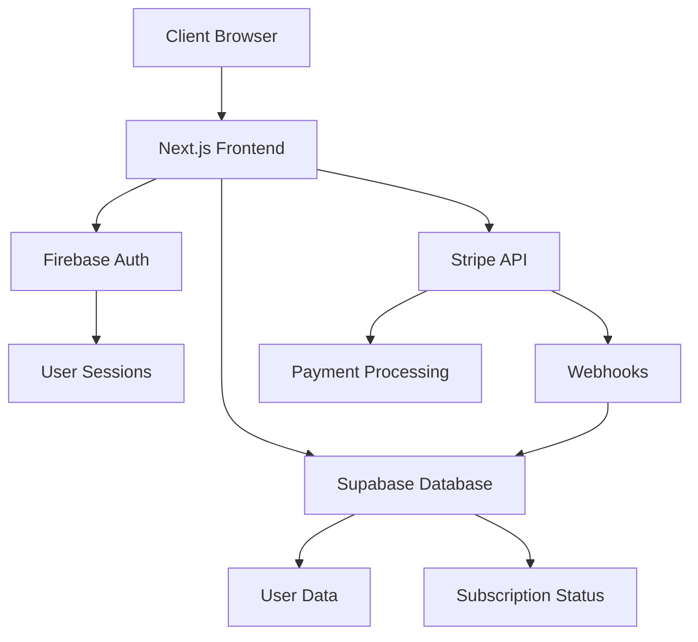

# Design Document

## Overview

The User Authentication System will transform Study Map into a freemium SaaS application with secure user management, subscription tiers, and payment processing. The system uses Firebase Auth for authentication, Supabase for data storage, and Stripe for payment processing, creating a robust and scalable architecture.

## Architecture

### High-Level Architecture



### Technology Stack

- **Frontend**: Next.js 14 with App Router, TailwindCSS
- **Authentication**: Firebase Auth (email/password + Google OAuth)
- **Database**: Supabase (PostgreSQL)
- **Payments**: Stripe Checkout with webhooks
- **State Management**: React Context + Custom Hooks
- **Middleware**: Next.js middleware for route protection

## Components and Interfaces

### Authentication Components

#### AuthProvider Context
```typescript
interface AuthContextType {
  user: User | null
  loading: boolean
  signIn: (email: string, password: string) => Promise<void>
  signUp: (email: string, password: string) => Promise<void>
  signInWithGoogle: () => Promise<void>
  signOut: () => Promise<void>
  refreshUserData: () => Promise<void>
}
```

#### UserPlan Hook
```typescript
interface UserPlanHook {
  plan: 'free' | 'premium'
  programsViewed: number
  canViewProgram: boolean
  incrementProgramView: () => Promise<void>
  upgradeUrl: string
}
```

### UI Components

#### LoginForm Component
- Email/password input fields
- Google Sign-In button
- Form validation and error handling
- Responsive design for mobile/desktop

#### PricingCards Component
- Free plan card (€0, 5 programs)
- Premium plan card (€20, unlimited)
- Feature comparison table
- Call-to-action buttons

#### UpgradePrompt Component
- Modal overlay when free limit reached
- Clear messaging about benefits
- Direct link to Stripe Checkout

#### ProgramCounter Component
- Visual progress bar (3/5 programs used)
- Contextual placement in header
- Real-time updates

### Payment Integration

#### Stripe Checkout Flow
1. User clicks "Upgrade to Premium"
2. Create Stripe Checkout session
3. Redirect to Stripe hosted page
4. Handle success/cancel redirects
5. Process webhook for payment confirmation

#### Webhook Handler
```typescript
interface StripeWebhookPayload {
  type: 'checkout.session.completed'
  data: {
    customer: string
    payment_status: 'paid'
    metadata: {
      userId: string
    }
  }
}
```

## Data Models

### Users Table (Supabase)
```sql
CREATE TABLE users (
  id UUID PRIMARY KEY DEFAULT gen_random_uuid(),
  email VARCHAR(255) UNIQUE NOT NULL,
  firebase_uid VARCHAR(255) UNIQUE NOT NULL,
  plan VARCHAR(20) DEFAULT 'free' CHECK (plan IN ('free', 'premium')),
  programs_viewed INTEGER DEFAULT 0,
  payment_status VARCHAR(20) DEFAULT 'pending' CHECK (payment_status IN ('pending', 'paid', 'failed')),
  stripe_customer_id VARCHAR(255),
  created_at TIMESTAMP WITH TIME ZONE DEFAULT NOW(),
  updated_at TIMESTAMP WITH TIME ZONE DEFAULT NOW()
);

CREATE INDEX idx_users_firebase_uid ON users(firebase_uid);
CREATE INDEX idx_users_email ON users(email);
CREATE INDEX idx_users_stripe_customer ON users(stripe_customer_id);
```

### Program Views Tracking
```sql
CREATE TABLE program_views (
  id UUID PRIMARY KEY DEFAULT gen_random_uuid(),
  user_id UUID REFERENCES users(id) ON DELETE CASCADE,
  program_id VARCHAR(255) NOT NULL,
  school_name VARCHAR(255) NOT NULL,
  viewed_at TIMESTAMP WITH TIME ZONE DEFAULT NOW()
);

CREATE INDEX idx_program_views_user_id ON program_views(user_id);
CREATE INDEX idx_program_views_viewed_at ON program_views(viewed_at);
```

### Payment Transactions
```sql
CREATE TABLE payment_transactions (
  id UUID PRIMARY KEY DEFAULT gen_random_uuid(),
  user_id UUID REFERENCES users(id) ON DELETE CASCADE,
  stripe_session_id VARCHAR(255) UNIQUE NOT NULL,
  amount INTEGER NOT NULL, -- Amount in cents
  currency VARCHAR(3) DEFAULT 'EUR',
  status VARCHAR(20) NOT NULL,
  created_at TIMESTAMP WITH TIME ZONE DEFAULT NOW()
);
```

## Error Handling

### Authentication Errors
- Invalid credentials → Clear error message
- Network issues → Retry mechanism
- Session expiry → Automatic redirect to login

### Payment Errors
- Card declined → User-friendly message with retry option
- Network timeout → Graceful fallback
- Webhook failures → Retry mechanism with exponential backoff

### Database Errors
- Connection issues → Cached data fallback
- Query failures → Error logging and user notification
- Data inconsistency → Automatic reconciliation

## Testing Strategy

### Unit Tests
- Authentication functions
- Payment processing logic
- Database operations
- UI component behavior

### Integration Tests
- Complete authentication flow
- Stripe webhook processing
- Database transactions
- Route protection middleware

### End-to-End Tests
- User registration and login
- Program viewing and limits
- Payment flow completion
- Plan upgrade verification

## Security Considerations

### Authentication Security
- Firebase Auth handles password hashing
- JWT tokens with appropriate expiration
- Secure session management
- CSRF protection

### Payment Security
- Stripe handles PCI compliance
- No card data stored locally
- Webhook signature verification
- Secure API key management

### Data Protection
- Environment variables for secrets
- Database connection encryption
- User data anonymization options
- GDPR compliance considerations

## Performance Optimizations

### Caching Strategy
- User session data in memory
- Plan status caching with TTL
- Database query optimization
- Static asset caching

### Database Performance
- Proper indexing on frequently queried fields
- Connection pooling
- Query optimization
- Pagination for large datasets

### Frontend Performance
- Code splitting for auth components
- Lazy loading of payment components
- Optimistic UI updates
- Error boundary implementation

## Deployment Considerations

### Environment Configuration
```bash
# Firebase
NEXT_PUBLIC_FIREBASE_API_KEY=
NEXT_PUBLIC_FIREBASE_AUTH_DOMAIN=
FIREBASE_ADMIN_PRIVATE_KEY=

# Supabase
NEXT_PUBLIC_SUPABASE_URL=
NEXT_PUBLIC_SUPABASE_ANON_KEY=
SUPABASE_SERVICE_ROLE_KEY=

# Stripe
NEXT_PUBLIC_STRIPE_PUBLISHABLE_KEY=
STRIPE_SECRET_KEY=
STRIPE_WEBHOOK_SECRET=
```

### Monitoring and Analytics
- User registration metrics
- Conversion rates (free to premium)
- Payment success/failure rates
- Program view analytics
- Error tracking and alerting